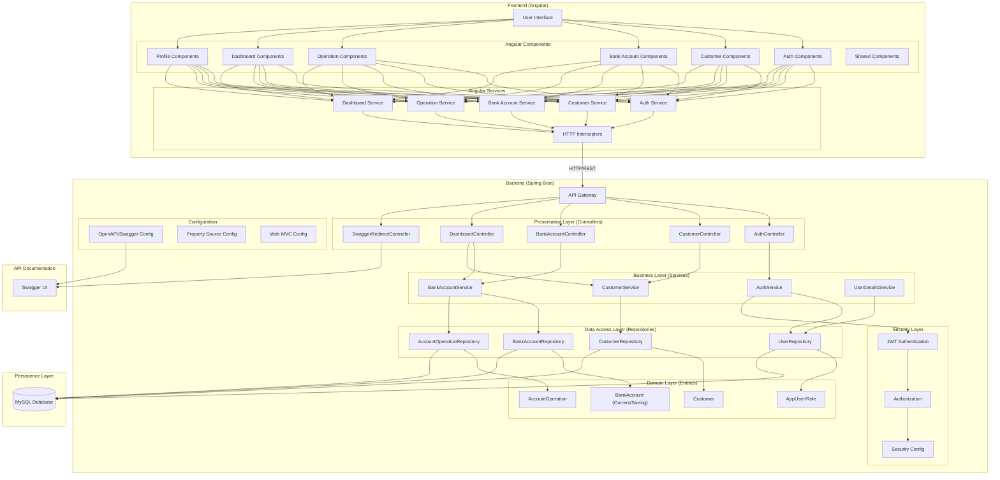

# Digital Banking Application Architecture

## Architecture Description

### Frontend (Angular)
- **User Interface**: The presentation layer that users interact with
- **Angular Components**: Modular UI components for different features
- **Angular Services**: Handle data operations and business logic on the client side

### Backend (Spring Boot)
- **Presentation Layer**: REST API controllers that handle HTTP requests
- **Business Layer**: Services implementing business logic and rules
- **Data Access Layer**: Repositories that interact with the database
- **Domain Layer**: Entity classes representing business objects
- **Security Layer**: JWT authentication and authorization mechanisms
- **Configuration**: Application and API documentation configuration

### Persistence Layer
- **MySQL Database**: Stores all application data

### API Documentation
- **Swagger UI**: Interactive API documentation and testing interface

## Data Flow
1. Users interact with the Angular frontend
2. Angular services make HTTP requests to the backend API
3. API controllers process requests and delegate to services
4. Services apply business logic and use repositories
5. Repositories perform CRUD operations on the database
6. Response flows back through the layers to the user interface

This architecture follows a typical multi-tier application design with separation of concerns and clear boundaries between layers.
